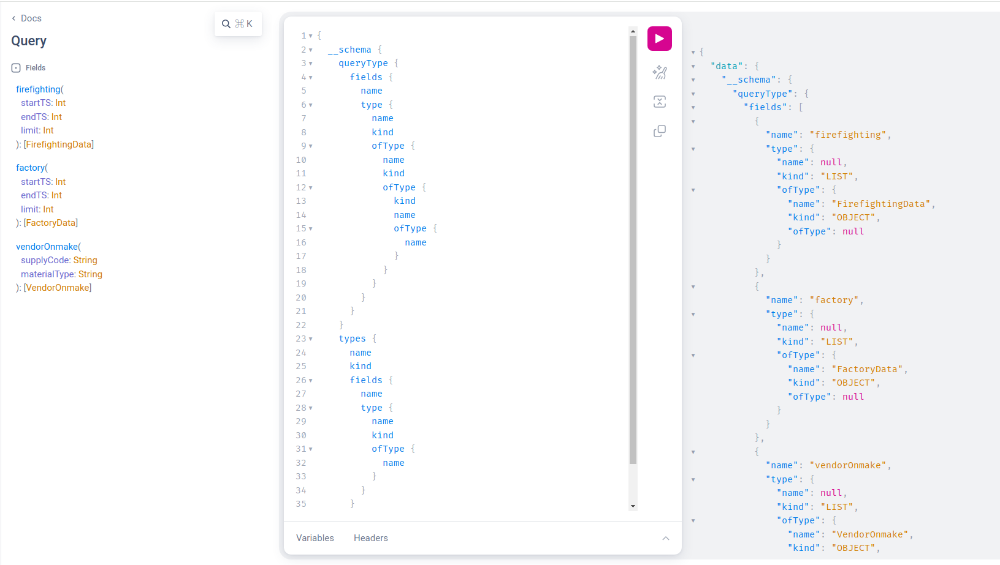
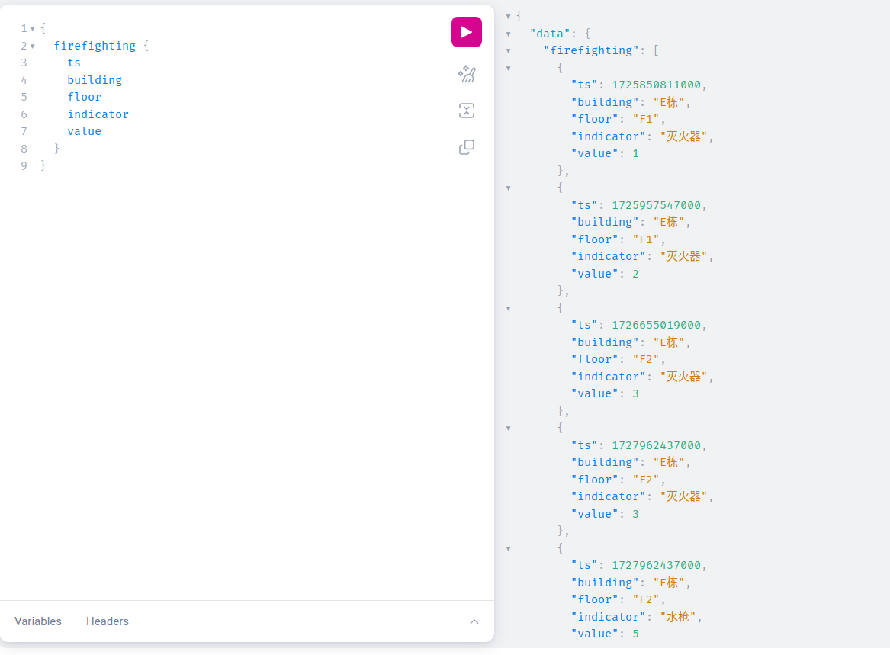

# graphql-db-api-example  

本项目提供了 [graphql-db-api](https://github.com/lujin3/graphql-db-api) 的 go demo 示例, 用于适配 superset 的 graphql db 数据源.  

使用 github.com/99designs/gqlgen 框架, 其他框架和语言只要 GraphQL schema 和 query 定义一致即可.

## 目录

- [添加新接口](#添加新接口)
- [快速开始](#快速开始)
- [GraphQL Schema 规格](#graphql-schema-规格)

## 添加新接口

按照以下步骤在您的 GraphQL 服务器中添加新的 API 端点：

1. **定义 schema**  
   在 `graph/schema.graphql` 中更新您的新 schema 定义。例如：

   ```graphql
    type FirefightingData {
        ts: Int! # 时间戳,若是时序数据必须定义,并且字段名固定为 `ts`
        building: String! # 指标属性(层级),根据业务数据定义,非必须
        floor: String! # 指标属性(层级),根据业务数据定义,非必须
        indicator: String! # 指标属性(层级),根据业务数据定义,非必须
        value: Int! # 指标的值
    }

   type Query {
        firefighting(startTS: Int, endTS: Int, limit: Int): [FirefightingData] # added
   }
   ```

   - 指标属性(层级) 非必须, 如需进行在 BI 中下钻数据,则属性(层级)必须明确且符合下钻场景的层级
   - 时序数据, ts 字段为必填字段

2. **生成 gqlgen 配置和模型**  
    运行以下命令以生成所需的文件：

    ```bash
    go run github.com/99designs/gqlgen generate
    ```  

3. **开发 resolver**  
    在 `graph/schema.resolvers.go` 中实现您新 API 的逻辑。该文件包含负责获取和返回数据的 resolver。

## 快速开始

### Start the graphql server  

```bash
go run server.go
```


## GraphQL Schema 规格  

### 规格

使用以下 Query 查询 Schema 定义：

```graphql
{
  __schema {
    queryType {
      fields {
        name
        type {
          name
          kind
          ofType {
            name
            kind
            ofType {
              kind
              name
              ofType {
                name
              }
            }
          }
        }
      }
    }
    types {
      name
      kind
      fields {
        name
        type {
          name
          kind
          ofType {
            name
          }
        }
      }
    }
  }
}
```  

以下是一个查询结果的示例：

```json
{
  "data": {
    "__schema": {
      "queryType": {
        "fields": [
          {
            "name": "firefighting",
            "type": {
              "name": null,
              "kind": "LIST",
              "ofType": {
                "name": "FirefightingData",
                "kind": "OBJECT",
                "ofType": null
              }
            }
          },
          {
            "name": "factory",
            "type": {
              "name": null,
              "kind": "LIST",
              "ofType": {
                "name": "FactoryData",
                "kind": "OBJECT",
                "ofType": null
              }
            }
          },
          {
            "name": "vendorOnmake",
            "type": {
              "name": null,
              "kind": "LIST",
              "ofType": {
                "name": "VendorOnmake",
                "kind": "OBJECT",
                "ofType": null
              }
            }
          }
        ]
      },
      "types": [
        {
          "name": "Boolean",
          "kind": "SCALAR",
          "fields": []
        },
        {
          "name": "FactoryData",
          "kind": "OBJECT",
          "fields": [
            {
              "name": "ts",
              "type": {
                "name": null,
                "kind": "NON_NULL",
                "ofType": {
                  "name": "Int"
                }
              }
            },
            {
              "name": "building",
              "type": {
                "name": null,
                "kind": "NON_NULL",
                "ofType": {
                  "name": "String"
                }
              }
            },
            {
              "name": "area",
              "type": {
                "name": null,
                "kind": "NON_NULL",
                "ofType": {
                  "name": "String"
                }
              }
            },
            {
              "name": "value",
              "type": {
                "name": null,
                "kind": "NON_NULL",
                "ofType": {
                  "name": "Int"
                }
              }
            }
          ]
        },
        {
          "name": "FirefightingData",
          "kind": "OBJECT",
          "fields": [
            {
              "name": "ts",
              "type": {
                "name": null,
                "kind": "NON_NULL",
                "ofType": {
                  "name": "Int"
                }
              }
            },
            {
              "name": "building",
              "type": {
                "name": null,
                "kind": "NON_NULL",
                "ofType": {
                  "name": "String"
                }
              }
            },
            {
              "name": "floor",
              "type": {
                "name": null,
                "kind": "NON_NULL",
                "ofType": {
                  "name": "String"
                }
              }
            },
            {
              "name": "indicator",
              "type": {
                "name": null,
                "kind": "NON_NULL",
                "ofType": {
                  "name": "String"
                }
              }
            },
            {
              "name": "value",
              "type": {
                "name": null,
                "kind": "NON_NULL",
                "ofType": {
                  "name": "Int"
                }
              }
            }
          ]
        },
        {
          "name": "Float",
          "kind": "SCALAR",
          "fields": []
        },
        {
          "name": "ID",
          "kind": "SCALAR",
          "fields": []
        },
        {
          "name": "Int",
          "kind": "SCALAR",
          "fields": []
        },
        {
          "name": "Query",
          "kind": "OBJECT",
          "fields": [
            {
              "name": "firefighting",
              "type": {
                "name": null,
                "kind": "LIST",
                "ofType": {
                  "name": "FirefightingData"
                }
              }
            },
            {
              "name": "factory",
              "type": {
                "name": null,
                "kind": "LIST",
                "ofType": {
                  "name": "FactoryData"
                }
              }
            },
            {
              "name": "vendorOnmake",
              "type": {
                "name": null,
                "kind": "LIST",
                "ofType": {
                  "name": "VendorOnmake"
                }
              }
            }
          ]
        },
        {
          "name": "String",
          "kind": "SCALAR",
          "fields": []
        },
        {
          "name": "VendorOnmake",
          "kind": "OBJECT",
          "fields": [
            {
              "name": "supplyName",
              "type": {
                "name": null,
                "kind": "NON_NULL",
                "ofType": {
                  "name": "String"
                }
              }
            },
            {
              "name": "supplyCode",
              "type": {
                "name": null,
                "kind": "NON_NULL",
                "ofType": {
                  "name": "String"
                }
              }
            },
            {
              "name": "materialName",
              "type": {
                "name": null,
                "kind": "NON_NULL",
                "ofType": {
                  "name": "String"
                }
              }
            },
            {
              "name": "materialType",
              "type": {
                "name": null,
                "kind": "NON_NULL",
                "ofType": {
                  "name": "String"
                }
              }
            },
            {
              "name": "processName",
              "type": {
                "name": null,
                "kind": "NON_NULL",
                "ofType": {
                  "name": "String"
                }
              }
            },
            {
              "name": "opId",
              "type": {
                "name": "Int",
                "kind": "SCALAR",
                "ofType": null
              }
            },
            {
              "name": "num",
              "type": {
                "name": null,
                "kind": "NON_NULL",
                "ofType": {
                  "name": "Int"
                }
              }
            }
          ]
        },
        {
          "name": "__Directive",
          "kind": "OBJECT",
          "fields": [
            {
              "name": "name",
              "type": {
                "name": null,
                "kind": "NON_NULL",
                "ofType": {
                  "name": "String"
                }
              }
            },
            {
              "name": "description",
              "type": {
                "name": "String",
                "kind": "SCALAR",
                "ofType": null
              }
            },
            {
              "name": "locations",
              "type": {
                "name": null,
                "kind": "NON_NULL",
                "ofType": {
                  "name": null
                }
              }
            },
            {
              "name": "args",
              "type": {
                "name": null,
                "kind": "NON_NULL",
                "ofType": {
                  "name": null
                }
              }
            },
            {
              "name": "isRepeatable",
              "type": {
                "name": null,
                "kind": "NON_NULL",
                "ofType": {
                  "name": "Boolean"
                }
              }
            }
          ]
        },
        {
          "name": "__DirectiveLocation",
          "kind": "ENUM",
          "fields": []
        },
        {
          "name": "__EnumValue",
          "kind": "OBJECT",
          "fields": [
            {
              "name": "name",
              "type": {
                "name": null,
                "kind": "NON_NULL",
                "ofType": {
                  "name": "String"
                }
              }
            },
            {
              "name": "description",
              "type": {
                "name": "String",
                "kind": "SCALAR",
                "ofType": null
              }
            },
            {
              "name": "isDeprecated",
              "type": {
                "name": null,
                "kind": "NON_NULL",
                "ofType": {
                  "name": "Boolean"
                }
              }
            },
            {
              "name": "deprecationReason",
              "type": {
                "name": "String",
                "kind": "SCALAR",
                "ofType": null
              }
            }
          ]
        },
        {
          "name": "__Field",
          "kind": "OBJECT",
          "fields": [
            {
              "name": "name",
              "type": {
                "name": null,
                "kind": "NON_NULL",
                "ofType": {
                  "name": "String"
                }
              }
            },
            {
              "name": "description",
              "type": {
                "name": "String",
                "kind": "SCALAR",
                "ofType": null
              }
            },
            {
              "name": "args",
              "type": {
                "name": null,
                "kind": "NON_NULL",
                "ofType": {
                  "name": null
                }
              }
            },
            {
              "name": "type",
              "type": {
                "name": null,
                "kind": "NON_NULL",
                "ofType": {
                  "name": "__Type"
                }
              }
            },
            {
              "name": "isDeprecated",
              "type": {
                "name": null,
                "kind": "NON_NULL",
                "ofType": {
                  "name": "Boolean"
                }
              }
            },
            {
              "name": "deprecationReason",
              "type": {
                "name": "String",
                "kind": "SCALAR",
                "ofType": null
              }
            }
          ]
        },
        {
          "name": "__InputValue",
          "kind": "OBJECT",
          "fields": [
            {
              "name": "name",
              "type": {
                "name": null,
                "kind": "NON_NULL",
                "ofType": {
                  "name": "String"
                }
              }
            },
            {
              "name": "description",
              "type": {
                "name": "String",
                "kind": "SCALAR",
                "ofType": null
              }
            },
            {
              "name": "type",
              "type": {
                "name": null,
                "kind": "NON_NULL",
                "ofType": {
                  "name": "__Type"
                }
              }
            },
            {
              "name": "defaultValue",
              "type": {
                "name": "String",
                "kind": "SCALAR",
                "ofType": null
              }
            }
          ]
        },
        {
          "name": "__Schema",
          "kind": "OBJECT",
          "fields": [
            {
              "name": "description",
              "type": {
                "name": "String",
                "kind": "SCALAR",
                "ofType": null
              }
            },
            {
              "name": "types",
              "type": {
                "name": null,
                "kind": "NON_NULL",
                "ofType": {
                  "name": null
                }
              }
            },
            {
              "name": "queryType",
              "type": {
                "name": null,
                "kind": "NON_NULL",
                "ofType": {
                  "name": "__Type"
                }
              }
            },
            {
              "name": "mutationType",
              "type": {
                "name": "__Type",
                "kind": "OBJECT",
                "ofType": null
              }
            },
            {
              "name": "subscriptionType",
              "type": {
                "name": "__Type",
                "kind": "OBJECT",
                "ofType": null
              }
            },
            {
              "name": "directives",
              "type": {
                "name": null,
                "kind": "NON_NULL",
                "ofType": {
                  "name": null
                }
              }
            }
          ]
        },
        {
          "name": "__Type",
          "kind": "OBJECT",
          "fields": [
            {
              "name": "kind",
              "type": {
                "name": null,
                "kind": "NON_NULL",
                "ofType": {
                  "name": "__TypeKind"
                }
              }
            },
            {
              "name": "name",
              "type": {
                "name": "String",
                "kind": "SCALAR",
                "ofType": null
              }
            },
            {
              "name": "description",
              "type": {
                "name": "String",
                "kind": "SCALAR",
                "ofType": null
              }
            },
            {
              "name": "fields",
              "type": {
                "name": null,
                "kind": "LIST",
                "ofType": {
                  "name": null
                }
              }
            },
            {
              "name": "interfaces",
              "type": {
                "name": null,
                "kind": "LIST",
                "ofType": {
                  "name": null
                }
              }
            },
            {
              "name": "possibleTypes",
              "type": {
                "name": null,
                "kind": "LIST",
                "ofType": {
                  "name": null
                }
              }
            },
            {
              "name": "enumValues",
              "type": {
                "name": null,
                "kind": "LIST",
                "ofType": {
                  "name": null
                }
              }
            },
            {
              "name": "inputFields",
              "type": {
                "name": null,
                "kind": "LIST",
                "ofType": {
                  "name": null
                }
              }
            },
            {
              "name": "ofType",
              "type": {
                "name": "__Type",
                "kind": "OBJECT",
                "ofType": null
              }
            },
            {
              "name": "specifiedByURL",
              "type": {
                "name": "String",
                "kind": "SCALAR",
                "ofType": null
              }
            }
          ]
        },
        {
          "name": "__TypeKind",
          "kind": "ENUM",
          "fields": []
        }
      ]
    }
  }
}
```




### 说明

根据 schema 组合出接口的字段名和对应的类型

1. 获取 schema 中所有的 fields 和 type (`queryType["fields"]["type"]["ofType"]["name"]`)

2. 根据 type 获取 type 下 fields (字段)的 name 和 type
